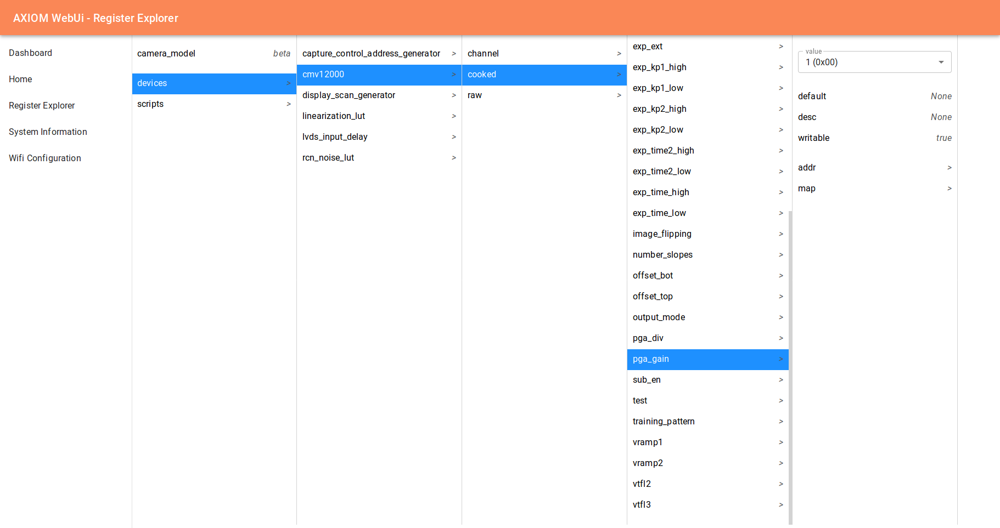

# AXIOM ctrl
A driver for controlling AXIOM cameras.

## Working Principle
The code in this repository takes care of all the low level communication to the hardware
of the camera (ie. the image sensor). This is done with a variety of protocols (ie. `i2c`
or memory access to shared memory regions with the FPGA).

Similar to a Linux kernel driver, a filesystem hierarchy is exposed, which represents the
different parameters of the hardware.

Exposing the parameters as a filesystem allows for simple solutions for a wide veriety
of use cases:
1) Write/ Read single parameters:
    ```bash
    $ cat /axiom_api/devices/cmv12000/cooked/pga_gain/value
    1
    $ echo -n "2" > /axiom_api/devices/cmv12000/cooked/pga_gain/value # sets the analog gain to 2×
    ```
2) List available parameters:
    ```bash
    $ ls /axiom_api/devices/cmv12000/cooked/
	pga_gain pga_div ...
    ```
3) Get information about parameters:
    ```bash
    $ cat /axiom_api/devices/cmv12000/cooked/pga_gain/description
	analog gain
    ```

This simple abstraction allows to easily create powerful tools that build upon ctrl, like the register explorer of the [webui](https://github.com/axiom-micro/webui).



## No Kernel Space Code
However, no kernel code is needed to expose the outlined functionality and `FUSE` is used 
to implement the filesystem. This gives better debuggability and allows us to code
rust instead of kernel style C at the cost of some performance penalty and loosing the ability to handle
interrupts.


## Developing locally
make the axiom_api directory under nctrl file
```bash
$ mkdir ./axiom_api
```
run this command under nctrl directory
```
$ cargo run -- --mock --mountpoint ./axiom_api camera_descriptions/beta/beta.yml
```
Note:

if it shows the error 

```error: failed to load source for a dependency on `fuse` ```

then run this command in nctrl directory

```$ git submodule update --recursive --init ```

## Concepts
The control daemon parses a `YAML` file that describes the camera setup and the available `devices`. A `device` consist of four parts:
1) A communication channel, that specifies how registers are read and written. This can for example be a memory mapped region or a i2c device. The different communication channels are implemented in rust and the configuration file specifies the necessary parameters. For example
   ```yaml
   channel:
   mode: "i2c-cdev"
	 bus: 0
	 address: 0x10
   ``` 
2) Raw registers, that assign a address a name and potentially some metadata like the width of the register, a description, min and max values or a default. 
   ```yaml
   temp_sensor:
     address: 127
     width: 2
     default: 0
     description: >
        Read-Only. Contains a value for calculating the sensor temperature.
   ```
3) Cooked registers, that assign a bit slice of a raw register or a address a name, metadata like the raw registers and potentially a value map. This map can map the raw register values to either floats, ints or strings. If such a map is present, reading a cooked register automatically returns the value assigned by the map and writing to such a register converts the given value to the raw value using this map. For example:
   ```yaml
   pga_gain:
     address: pga[0:3]
     description: analog gain
     map:
       0: 1
       1: 2
       3: 3
       7: 4
   ```
   This assigns a raw value of 0 the *cooked* value 1, the raw value 1 the *cooked* value 2 and so forth. Writing 4 to this register would write 7 to the first three bits of the raw register `pga`. If the first three bits of the raw register `pga` contain the value 1 reading this register would return 2.
4) Computed registers, that allow for arbitrary lua scripts to read and write a combination of registers. This could for example be used to provide a way to directly set a ISO value, which then sets a combination of digital gain, analog gain and potentially other registers. For example: 
   ```yaml
   analog_gain:
     description: "Sets the analog gain"
     type: float
     get: return cooked.coarse_gain * cooked.fine_gain
     set: >
       local coarse = math.floor(value)
       local fine = value / coarse
       cooked.coarse_gain = coarse
       cooked.fine_gain = fine
   ```
   This would provide a computed register for setting and reading the analog gain on the `ar0330` image sensor.
   
   
The last part of a camera are scripts, which are a series of arbitrary register (raw, cooked or computed) operations. Using scripts allows to prevent any register accesses / writes by others between two different register operations. For example when starting up a image sensor a series of different registers writes of different devices is often necessary, which should not be interrupted by register accesses / writes by others. Currently scripts can only be written in rust, but support for lua scripts is planned. A rust script to start the `ar0330` image sensor in default settings on the `micro-r2` can be found [here](https://github.com/axiom-micro/nctrl/blob/22a7d3a7d807f4f61ecc9a48c7f98fcbab88318c/src/sensor.rs#L906-L1051)

